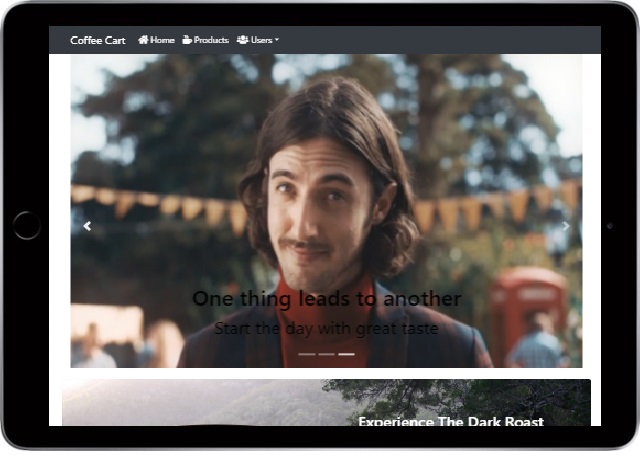
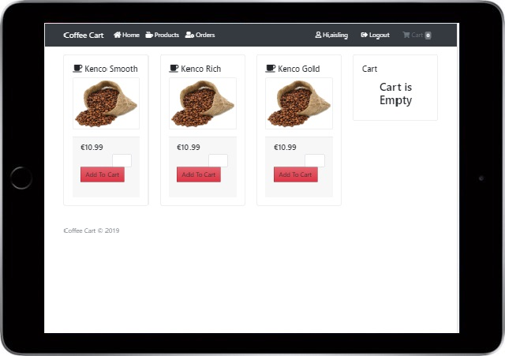
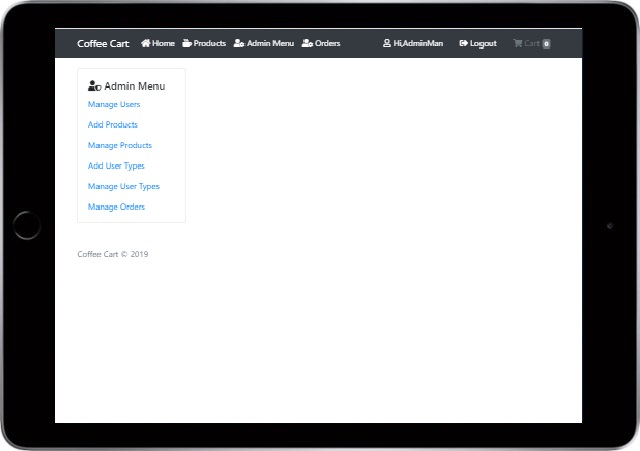
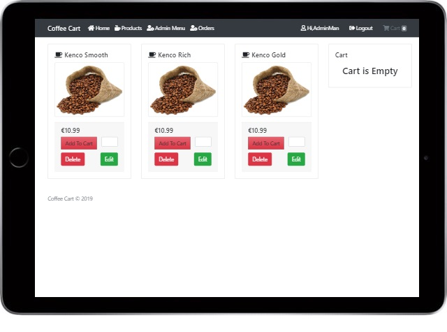
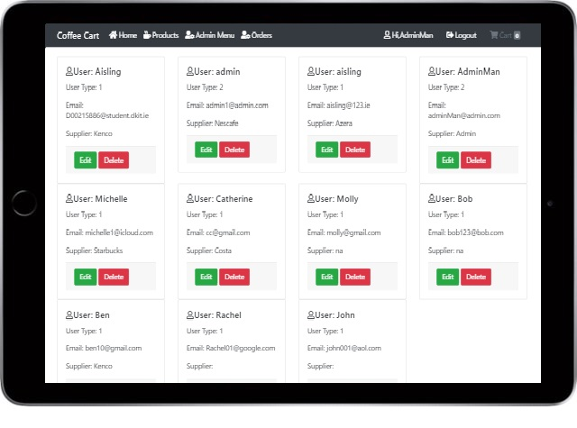

# Coffee Cart
Our website is designed to store information about coffees, users, user types and orders which is all located inside the database.

## Table of contents

- [Introduction](#Introduction)
- [Project Features](#project-features)
- [Improvements](#improvements)
- [Application](#application)
- [References](#references)

## Introduction
A non existing user will be able to visit the website, view the home page, view the products and their prices and register. Exisitng users will be able to log in and view the products with the option of inputing a quantity and also a button for add to cart displayed. Exisitng users will alos be able to see any orders that are saved in the database.
There is also an admin log in section. The admin users control the edit,delete and add for coffees. They also manage users and add,delete and edit user types.

## Project Features
- Applied MVC for Users, User types, Coffees and Orders
- Create, read, update and delete for users
- Create, read, update and delete for coffees
- Create, read, update and delete for orders
- Create, read, update and delete for user types
- Ajax/Javascript to check sign up values in form before being submitted
- Bootstrap
- Font Awsome CSS (icons)
- Login/Sign up
- A collaborative Git repository

## Improvements
There was some features which I would have wished to implement if I had more time:
1. Get cart working through ajax
2. Making the site look more attractive to a user
3. Confirm on delete/edit for more security for admin users
4. Error messages for the forms could be improved
5. Use more images and more bootstrap

## Application
- The home screen that exisitng and non existing users will be able to view

- Logged in users will get these options on products

- The admin menu can only be accessed by a logged in admin

- Admin will get all the options below for products

- Admin will be able to control users

## References
- Our lecturer Shane Gavin has provided a starter project on this link :https://gitlab.comp.dkit.ie/gavins/  as built in class
- Shane also provided youtube videos that were helpful to refresh the code during the easter holidays
- For the front end frame work we have used Boostrap :https://getbootstrap.com/ and :https://jquery.com/